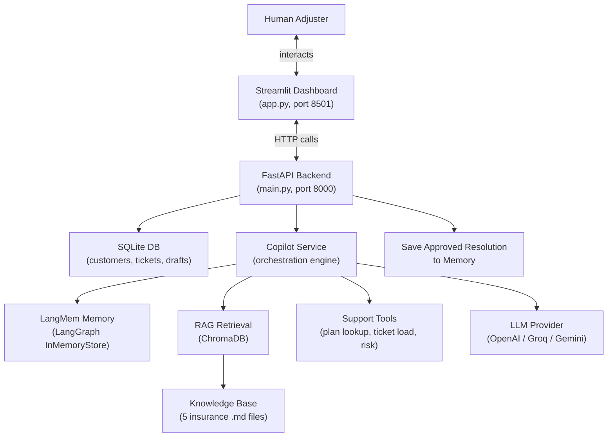
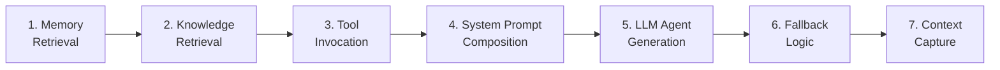
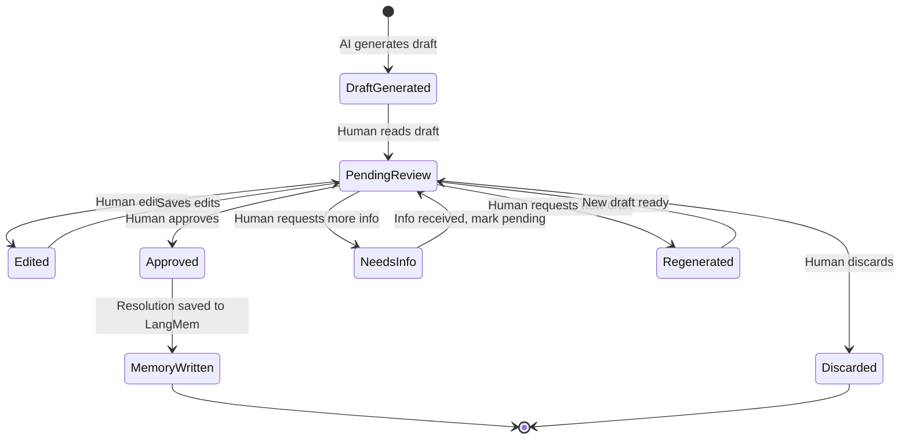

# 🎯 Insurance Claims Support AI Agent — Complete Project Walkthrough

> **Purpose**: Presentation-ready guide covering functional concept, technical architecture, every API, every component, insurance domain terms, and a local testing playbook.

---

## 1. WHAT IS THIS PROJECT? (The Concept)

This is an **internal AI copilot** that helps **human insurance claims adjusters** handle **First Notice of Loss (FNOL)** and claim-support workflows.

### The Problem It Solves
When a customer reports an insurance claim (car accident, theft, water damage), a human **claims adjuster** must:
- Look up the customer's policy and prior claim history
- Check company guidelines for that claim type
- Draft a recommendation (approve, deny, request more info)
- Ensure no fraud signals are present

This is slow, error-prone, and inconsistent. **This AI agent automates the draft-generation step** while keeping the human in full control.

### The Key Principle
> **The AI never makes a final claim decision.** It drafts a recommendation. A licensed human adjuster reviews, edits, approves, or discards it. This is called **Human-in-the-Loop (HITL)**.

In this project, approving a draft means approving the AI-generated recommendation and saving that recommendation to memory. It does not automatically approve, deny, settle, or close the actual insurance claim. Claim/ticket status and draft status are separate workflow states.

---

## 2. INSURANCE DOMAIN TERMS

| Term | Meaning |
|------|---------|
| **FNOL** | First Notice of Loss — the initial report a customer files when something bad happens (accident, theft, etc.) |
| **Claims Adjuster** | Licensed professional who investigates and decides on insurance claims |
| **Policy** | The insurance contract a customer holds (e.g., `POL-AUTO-10293`) |
| **Plan Tier** | Level of coverage — e.g., "Premium Auto" (24h SLA) vs "Standard Auto" (48h SLA) |
| **SLA** | Service Level Agreement — the promised response time (e.g., 24 hours for Premium) |
| **Claim Narrative** | The customer's description of what happened |
| **Claim Type** | Category: Auto Collision, Auto Comprehensive, Home Theft, Home Water Damage |
| **Deductible** | The amount the customer pays out-of-pocket before insurance kicks in |
| **Coverage Approval/Denial** | Whether the insurance company will pay for the claim |
| **Fraud Signals** | Red flags suggesting a claim might be fraudulent (e.g., "no witnesses", "urgent payout") |
| **Draft Recommendation** | AI-generated suggested response for the adjuster to review |
| **Resolution** | The final approved recommendation that becomes part of institutional memory |
| **Draft Status** | Review state of the AI draft: pending, approved, discarded, or needs_info |
| **Claim / Ticket Status** | Operational state of the claim ticket, such as open, pending_info, or closed |

---

## 3. HIGH-LEVEL ARCHITECTURE



### Two Running Processes
1. **FastAPI Backend** → `python -m customer_support_agent.main` → runs on **port 8000**
2. **Streamlit Dashboard** → `streamlit run app.py` → runs on **port 8501**

The Streamlit dashboard makes HTTP requests to the FastAPI backend. They are **decoupled**.

---

## 4. THE 7-STEP COPILOT PIPELINE

This is the **heart of the project** — the AI draft-generation pipeline in [copilot_service.py](file:///e:/LEARNBY%20CERTIFICATION%20PROJECTS/learnby%20final%20project/Insurance%20Claim%20Support%20AI%20Agent/customer_support_agent/services/copilot_service.py).



| Step | What Happens | File |
|------|-------------|------|
| **1. Memory Retrieval** | Searches LangMem for prior approved resolutions for this customer + company | [langmem_store.py](file:///e:/LEARNBY%20CERTIFICATION%20PROJECTS/learnby%20final%20project/Insurance%20Claim%20Support%20AI%20Agent/customer_support_agent/integrations/memory/langmem_store.py) |
| **2. Knowledge Retrieval** | Searches ChromaDB for relevant insurance guidelines (deductibles, FNOL checklist, etc.) | [chroma_kb.py](file:///e:/LEARNBY%20CERTIFICATION%20PROJECTS/learnby%20final%20project/Insurance%20Claim%20Support%20AI%20Agent/customer_support_agent/integrations/rag/chroma_kb.py) |
| **3. Tool Invocation** | Calls `lookup_customer_plan`, `lookup_open_ticket_load`, `analyze_claim_risk` | [support_tools.py](file:///e:/LEARNBY%20CERTIFICATION%20PROJECTS/learnby%20final%20project/Insurance%20Claim%20Support%20AI%20Agent/customer_support_agent/integrations/tools/support_tools.py), [claim_risk_tools.py](file:///e:/LEARNBY%20CERTIFICATION%20PROJECTS/learnby%20final%20project/Insurance%20Claim%20Support%20AI%20Agent/customer_support_agent/integrations/tools/claim_risk_tools.py) |
| **4. System Prompt Composition** | Builds a detailed system prompt with memory context + knowledge context + tool outputs | `copilot_service.py` |
| **5. LLM Agent Generation** | Uses LangChain `create_agent` with tools bound to the LLM | `copilot_service.py` |
| **6. Fallback Logic** | If the agent returns empty, retries with a simpler direct LLM call | `copilot_service.py` |
| **7. Context Capture** | Packages `memory_hits`, `knowledge_hits`, `tool_calls`, `errors`, `signals` for transparency | `copilot_service.py` |

---

## 5. ALL APIs — COMPLETE ENDPOINT LIST

### 5.1 Health Router (`/health`)
| Method | Endpoint | Purpose |
|--------|----------|---------|
| GET | `/health` | Health check — confirms backend is running |

### 5.2 Customer Router (`/customers`) — 4 endpoints
| Method | Endpoint | Purpose |
|--------|----------|---------|
| POST | `/customers` | Create a new customer |
| GET | `/customers` | List all customers |
| GET | `/customers/{customer_id}` | Get customer by ID |
| GET | `/customers/email/{email}` | Get customer by email |

### 5.3 Ticket Router (`/tickets`) — 5 endpoints
| Method | Endpoint | Purpose |
|--------|----------|---------|
| POST | `/tickets` | Create a new ticket (claim/FNOL) |
| GET | `/tickets` | List all tickets |
| GET | `/tickets/{ticket_id}` | Get ticket by ID |
| GET | `/tickets/customer/{customer_id}` | List tickets for a customer |
| PATCH | `/tickets/{ticket_id}` | Update ticket status |

### 5.4 Draft Router (`/drafts`) — 9 endpoints ⭐ (most complex)
| Method | Endpoint | Purpose |
|--------|----------|---------|
| POST | `/drafts` | Generate AI draft for a ticket |
| GET | `/drafts/{draft_id}` | Get a draft by ID |
| GET | `/drafts/ticket/{ticket_id}` | List all drafts for a ticket |
| GET | `/drafts/{draft_id}/history` | Get revision history for a draft |
| PATCH | `/drafts/{draft_id}` | Save human edits to draft text |
| PUT | `/drafts/{draft_id}/approve` | **Approve** draft → writes to memory |
| PUT | `/drafts/{draft_id}/discard` | **Discard** draft |
| PUT | `/drafts/{draft_id}/request-info` | Mark draft as needing more info |
| PUT | `/drafts/{draft_id}/mark-pending` | Return draft to pending review |
| POST | `/drafts/{draft_id}/regenerate` | Create a fresh AI revision |

### 5.5 Knowledge Router (`/knowledge`) — 3 endpoints
| Method | Endpoint | Purpose |
|--------|----------|---------|
| GET | `/knowledge/stats` | Collection stats (document count) |
| POST | `/knowledge/ingest` | Ingest/refresh knowledge base from markdown files |
| POST | `/knowledge/query` | Search knowledge base (RAG query) |

### 5.6 Memory Router (`/memory`) — 2 endpoints
| Method | Endpoint | Purpose |
|--------|----------|---------|
| GET | `/memory/status` | Memory backend health/debug info |
| GET | `/memory/probe` | Search claim-history memory |

### 5.7 Dashboard Router (`/dashboard`) — 1 endpoint
| Method | Endpoint | Purpose |
|--------|----------|---------|
| GET | `/dashboard/stats` | Aggregate metrics for home page |

### 5.8 Logging Router (`/logging`) — 1 endpoint
| Method | Endpoint | Purpose |
|--------|----------|---------|
| PUT | `/logging/level` | Change runtime log level |

**Total: ~26 endpoints across 8 routers**

---

## 6. HUMAN-IN-THE-LOOP WORKFLOW

This is a **hard requirement** — the AI **never** autonomously approves or denies a claim.



### Why HITL Matters in Insurance
- **Compliance**: Insurance decisions must be made by licensed adjusters
- **Accountability**: A human is legally responsible for claim outcomes
- **Judgment**: Edge cases require human expertise the AI cannot reliably provide
- **Audit Trail**: `approved_by`, `adjuster_notes`, `context_used` create a full audit record

---

## 7. HOW LANGMEM IS USED (Memory Layer)

### File: [langmem_store.py](file:///e:/LEARNBY%20CERTIFICATION%20PROJECTS/learnby%20final%20project/Insurance%20Claim%20Support%20AI%20Agent/customer_support_agent/integrations/memory/langmem_store.py)

### What It Does
LangMem provides **long-term memory** so the AI remembers past approved resolutions. When a similar claim comes in later, it can reference what was done before.

### Two Memory Scopes
| Scope | Namespace | Example |
|-------|-----------|---------|
| **Customer** | `("memories", "customer", "jane_dot_doe_at_example_dot_com")` | Past resolutions for Jane Doe specifically |
| **Company** | `("memories", "company", "acme_insurance_co")` | Past resolutions across all of Acme's customers |

### Memory Lifecycle
1. **Write**: When a human **approves** a draft, `write_resolution_memory()` saves it to BOTH customer and company scopes
2. **Read**: When generating a NEW draft, `retrieve_relevant_memories()` searches both scopes for relevant prior resolutions
3. **Deduplication**: If the same resolution appears in both scopes, it's deduplicated

### Important Runtime Note
The current memory backend is LangGraph `InMemoryStore`. Approved draft resolutions are available while the backend process is running, but they are not persisted across backend restarts. SQLite persists customers, tickets, and drafts; memory entries would need a persistent memory backend to survive restarts.

### Semantic vs Fallback Search
- **Semantic search enabled** (when OpenAI/Gemini embeddings are configured): Searches by meaning using cosine similarity
- **Fallback** (no embeddings): Returns most recent memories in order — "recency-ordered listing"

### Key Technical Details
- Uses `LangGraph InMemoryStore` as the storage backend
- Email normalization: `@` → `_at_`, `.` → `_dot_` (LangGraph namespaces can't contain these)
- Embedding dimensions are auto-detected: `text-embedding-3-small` = 1536 dims
- The `raw_store` property exposes the underlying store for `create_agent(store=...)` integration

---

## 8. HOW RAG WORKS (Knowledge Retrieval)

### File: [chroma_kb.py](file:///e:/LEARNBY%20CERTIFICATION%20PROJECTS/learnby%20final%20project/Insurance%20Claim%20Support%20AI%20Agent/customer_support_agent/integrations/rag/chroma_kb.py)

### The 5 Knowledge Base Documents
| File | Content |
|------|---------|
| `insurance-auto-claims-fnol-intake-checklist.md` | Step-by-step FNOL intake checklist |
| `insurance-auto-coverage-and-deductible-guidelines.md` | Coverage types, deductible rules |
| `insurance-auto-required-documents-by-claim-type.md` | Required docs per claim type |
| `insurance-claims-fraud-risk-indicators.md` | Red flags for fraud detection |
| `insurance-claims-settlement-sla-and-communication.md` | SLA timelines, communication rules |

Only `knowledge_base/insurance-*.md` files are considered in scope for this project when those files exist. On backend startup and on manual refresh, the Chroma collection is rebuilt so out-of-scope project documentation and banking examples do not show up in search results.

### RAG Pipeline
1. **Load**: Read each `.md` file from `knowledge_base/`
2. **Chunk**: Split into ~800-character chunks with 120 overlap using `RecursiveCharacterTextSplitter`
3. **Embed**: Convert chunks to vectors via OpenAI `text-embedding-3-small`
4. **Upsert**: Store in ChromaDB with `source` and `chunk_index` metadata
5. **Query**: At draft time, embed the claim narrative → find top-4 most relevant chunks

### Embedding Fallback
If no API key is configured, ChromaDB uses its **built-in local ONNX model** (MiniLM) — no external API needed.

---

## 9. THE THREE SUPPORT TOOLS

### Tool 1: `lookup_customer_plan`
- **File**: [support_tools.py](file:///e:/LEARNBY%20CERTIFICATION%20PROJECTS/learnby%20final%20project/Insurance%20Claim%20Support%20AI%20Agent/customer_support_agent/integrations/tools/support_tools.py)
- **Returns**: `plan_tier`, `sla_hours`, `policy_number`
- **Purpose**: The AI knows what coverage the customer has and how fast it must respond

The backend schema uses `plan_tier` and `policy_number`; `policy_name` is not a required field in the current implementation.

### Tool 2: `lookup_open_ticket_load`
- **File**: `support_tools.py`
- **Returns**: `open_ticket_count`, `open_claim_count`
- **Purpose**: Gauge workload before recommending escalation

### Tool 3: `analyze_claim_risk` (Bonus)
- **File**: [claim_risk_tools.py](file:///e:/LEARNBY%20CERTIFICATION%20PROJECTS/learnby%20final%20project/Insurance%20Claim%20Support%20AI%20Agent/customer_support_agent/integrations/tools/claim_risk_tools.py)
- **Returns**: `risk_level` (low/medium/high), `confidence`, `fraud_signals[]`, `recommended_action`
- **How**: Deterministic keyword matching — looks for "no witnesses", "urgent payout", "contradict", etc.
- **Purpose**: Flags suspicious claims BEFORE the adjuster reviews them

### Data Gateway Pattern
Tools don't access the database directly. They use `CustomerDataGateway` (a Protocol/interface). At startup, `app_factory.py` swaps in the real `CustomerRepository` via `set_customer_data_gateway()`. This is **Dependency Inversion**.

---

## 10. STREAMLIT DASHBOARD PAGES

### File: [customer_support_agent/app.py](file:///e:/LEARNBY%20CERTIFICATION%20PROJECTS/learnby%20final%20project/Insurance%20Claim%20Support%20AI%20Agent/customer_support_agent/app.py)

| Page | What It Does |
|------|-------------|
| **Home** | Dashboard metrics: total customers, total claims, open claims, pending drafts, needs-info count + recent claims list |
| **Customer Lookup** | Search by email, view customer details, claim history. Create new customers |
| **Claim Intake** | Select customer → create a new FNOL ticket with subject, type, narrative |
| **Draft Management** | Generate AI draft, edit text, approve/discard/regenerate/request-info. Shows risk alerts and full context |
| **Knowledge & Memory** | Ingest/query knowledge base. Probe memory for prior resolutions. Shows memory backend status |
| **About** | Technology overview |

### How To Check Approval In The UI
- Use **Draft Management -> Review Draft** and load a Draft ID or customer email.
- Check **Draft Status** to verify whether the draft is `approved`.
- Do not use **Claim Status** as the draft-approval indicator. Claim Status belongs to the claim/ticket workflow and may remain `open` after a draft is approved.
- To inspect another customer's draft, enter that customer's email in Draft Management, click **Find Customer Claims**, select the claim, then switch to **Review Draft**.

---

## 11. DESIGN PATTERNS & TECH TERMS

| Pattern | Where Used | Why |
|---------|-----------|-----|
| **Strategy + Factory** | `integrations/llm/factory.py`, `integrations/embeddings/factory.py` | Swap LLM/embedding providers by changing `.env` — no code changes |
| **Dependency Inversion (DIP)** | Settings, LLM providers, tools gateway | Components depend on abstractions, not concrete implementations |
| **Repository Pattern** | `data/repositories/*.py` | Isolates SQLite access; each entity has its own repository |
| **App Factory** | `api/app_factory.py` | Single place to assemble FastAPI app, middleware, routers |
| **Protocol (Interface)** | `CustomerDataGateway` | Python's structural subtyping — any class with the right methods works |
| **Singleton/lru_cache** | `get_settings()`, `get_llm_provider()`, `get_memory_store()` | One instance process-wide, parsed once |

---

## 12. FILE-TO-COMPONENT MAP

```
Insurance Claim Support AI Agent/
├── app.py                          → Streamlit entrypoint (delegates to customer_support_agent/app.py)
├── customer_support_agent/
│   ├── main.py                     → Uvicorn entrypoint (FastAPI server)
│   ├── app.py                      → Streamlit dashboard (551 lines, 6 pages)
│   ├── core/
│   │   ├── settings.py             → Central config (pydantic-settings, reads .env)
│   │   └── logging_config.py       → Logging setup
│   ├── api/
│   │   ├── app_factory.py          → FastAPI assembly (lifespan, routers, middleware)
│   │   └── routers/                → 8 routers (health, customers, tickets, drafts, knowledge, memory, dashboard, logging)
│   ├── data/
│   │   ├── database.py             → SQLite connection + schema (3 tables)
│   │   └── repositories/           → CustomerRepository, TicketRepository, DraftRepository
│   ├── integrations/
│   │   ├── llm/                    → LLM abstraction (OpenAI/Groq/Gemini providers + factory)
│   │   ├── embeddings/             → Embedding abstraction (OpenAI/Gemini/ChromaDefault + factory)
│   │   ├── rag/chroma_kb.py        → ChromaDB RAG (ingest + search)
│   │   ├── memory/langmem_store.py → LangMem memory (customer/company scopes)
│   │   └── tools/                  → 3 LangChain tools + data gateway
│   ├── schemas/shared.py           → All Pydantic request/response models
│   └── services/
│       ├── copilot_service.py      → THE HEART: 7-step pipeline
│       ├── draft_service.py        → Draft CRUD + approval → memory write
│       ├── knowledge_service.py    → KB ingestion/query wrapper
│       ├── memory_service.py       → Memory probe wrapper
│       └── dashboard_service.py    → Aggregate stats
├── knowledge_base/                 → 5 insurance markdown files
├── storage/db/                     → SQLite database file (app.db)
├── storage/vector_store/           → ChromaDB persistent storage
└── tests/                          → 12 test files (pytest)
```

---

## 13. LOCAL TESTING GUIDE — Step by Step

### Prerequisites
1. Python 3.11+ installed
2. Virtual environment activated
3. `pip install -r requirements.txt` done
4. `.env` file with `OPENAI_API_KEY` set

### Step 1: Start the FastAPI Backend

```powershell
# Terminal 1 — from project root
cd "e:\LEARNBY CERTIFICATION PROJECTS\learnby final project\Insurance Claim Support AI Agent"
.venv\Scripts\activate
python -m customer_support_agent.main
```

You should see logs like:
```
INFO: Starting Insurance Claims Support AI Agent (env=development, llm_provider=openai, embedding_provider=openai)
INFO: Database schema initialized
INFO: Knowledge base already ingested (docs: XX)
INFO: Uvicorn running on http://0.0.0.0:8000
```

### Step 2: Verify Health

```powershell
curl http://localhost:8000/health
```

Expected: `{"status":"ok"}`

### Step 3: Start Streamlit Dashboard

```powershell
# Terminal 2 — from project root
cd "e:\LEARNBY CERTIFICATION PROJECTS\learnby final project\Insurance Claim Support AI Agent"
.venv\Scripts\activate
streamlit run app.py
```

Opens browser at `http://localhost:8501`

### Step 4: Complete End-to-End Flow via API (curl)

**4a. Create a Customer:**
```powershell
curl -X POST http://localhost:8000/customers -H "Content-Type: application/json" -d "{\"email\":\"test@example.com\",\"name\":\"Test User\",\"company_name\":\"Acme Insurance\",\"plan_tier\":\"Premium Auto\",\"sla_hours\":24}"
```
→ Save the returned `id` (e.g., `CUST_ID`)

**4b. Create a Ticket (FNOL):**
```powershell
curl -X POST http://localhost:8000/tickets -H "Content-Type: application/json" -d "{\"customer_id\":\"CUST_ID\",\"subject\":\"Rear-end collision on Highway 101\",\"claim_narrative\":\"I was stopped at a red light when another vehicle rear-ended me. No witnesses were present. Police report was filed.\",\"claim_type\":\"Auto Collision\"}"
```
→ Save the returned `id` (e.g., `TICKET_ID`)

**4c. Generate AI Draft:**
```powershell
curl -X POST http://localhost:8000/drafts -H "Content-Type: application/json" -d "{\"ticket_id\":\"TICKET_ID\",\"customer_id\":\"CUST_ID\"}"
```
→ This triggers the full 7-step pipeline. Save the returned `id` (e.g., `DRAFT_ID`)

**4d. View the Draft + Context:**
```powershell
curl http://localhost:8000/drafts/DRAFT_ID
```
→ Check `draft_text`, `context_used.memory_hits`, `context_used.knowledge_hits`, `context_used.tool_calls`

**4e. Approve the Draft (Human-in-the-Loop):**
```powershell
curl -X PUT http://localhost:8000/drafts/DRAFT_ID/approve -H "Content-Type: application/json" -d "{\"approved_by\":\"adjuster@company.com\",\"adjuster_notes\":\"Verified police report. Recommend standard coverage.\"}"
```
→ This writes the resolution to LangMem memory!

**4f. Probe Memory (verify resolution was saved):**
```powershell
curl "http://localhost:8000/memory/probe?customer_email=test@example.com&company_name=Acme+Insurance&query=rear-end+collision"
```
→ Should return the approved resolution as a memory hit

### Step 5: Test via Streamlit Dashboard

1. Open `http://localhost:8501`
2. **Customer Lookup** → Create a customer
3. Note the visible `Customer ID` shown in the UI after creation
4. **Claim Intake** → Look up the customer by email → file a new claim
5. Note the visible `Claim / Ticket ID` shown in the UI after creation or after selecting an existing claim
6. **Draft Management** → Generate draft → note the visible `Draft ID` → Review → Approve
7. In `Approver User ID / Email`, enter the adjuster's email or internal user ID. This project does not implement a separate user table for adjusters.
8. **Knowledge & Memory** → Query knowledge base → Probe memory

### Quick Knowledge Base Tests

Use the Knowledge Base tab and try:

- `deductible guidelines`
- `FNOL checklist`
- `required documents`
- `fraud indicators`
- `claim settlement SLA`

Expected behavior:

- results should cite only the insurance markdown files
- project documentation files should not appear
- clicking **Ingest / Refresh Knowledge Base** should rebuild the collection using only in-scope sources

### Step 6: Run Automated Tests

```powershell
pytest tests -q
```

### Step 7: Additional API Tests

```powershell
# Knowledge base stats
curl http://localhost:8000/knowledge/stats

# Search knowledge base
curl -X POST http://localhost:8000/knowledge/query -H "Content-Type: application/json" -d "{\"query\":\"deductible guidelines for collision\"}"

# Memory backend status
curl http://localhost:8000/memory/status

# Dashboard stats
curl http://localhost:8000/dashboard/stats

# List all tickets
curl http://localhost:8000/tickets

# Regenerate a draft
curl -X POST http://localhost:8000/drafts/DRAFT_ID/regenerate -H "Content-Type: application/json" -d "{\"reason\":\"Need more detail on coverage\"}"

# Discard a draft
curl -X PUT http://localhost:8000/drafts/DRAFT_ID/discard -H "Content-Type: application/json" -d "{\"reason\":\"Not applicable\"}"
```

---

## 14. THE `context_used` OBJECT — TRANSPARENCY

Every draft carries a `context_used` dict that shows **exactly** what the AI used to generate it:

```json
{
  "memory_hits": [{"memory_id": "...", "content": "...", "scope": "customer", "score": 0.92}],
  "knowledge_hits": [{"content": "...", "source": "insurance-auto-coverage-and-deductible-guidelines.md", "chunk_index": 3, "score": 0.15}],
  "tool_calls": [
    {"tool": "lookup_customer_plan", "output": {"plan_tier": "Premium Auto", "sla_hours": 24}},
    {"tool": "lookup_open_ticket_load", "output": {"open_ticket_count": 1}},
    {"tool": "analyze_claim_risk", "output": {"risk_level": "low", "confidence": 0.35}}
  ],
  "errors": [],
  "signals": {
    "memory_enabled": true,
    "memory_backend": "langgraph_in_memory_store",
    "memory_semantic_search": true,
    "memory_query_time_ms": 12.5,
    "llm_provider": "openai",
    "llm_model": "gpt-4o",
    "risk_level": "low"
  }
}
```

This is critical for **auditability** — an adjuster (or a regulator) can see exactly why the AI recommended what it did.

---

## 15. TECH STACK SUMMARY

| Layer | Technology | Purpose |
|-------|-----------|---------|
| **Backend Framework** | FastAPI + Uvicorn | REST API server |
| **Frontend** | Streamlit | Dashboard UI |
| **Database** | SQLite | Customers, tickets, drafts |
| **Vector Store** | ChromaDB (persistent) | RAG knowledge retrieval |
| **Memory** | LangMem + LangGraph InMemoryStore | Long-term claim-history memory |
| **LLM** | OpenAI GPT-4o (default) | Draft generation |
| **Embeddings** | OpenAI text-embedding-3-small | Semantic search for RAG + memory |
| **Orchestration** | LangChain create_agent | Agent with tool-calling |
| **Validation** | Pydantic v2 + pydantic-settings | Schema validation, config management |
| **Testing** | pytest | 12 test files, 50+ tests |
| **CI/CD** | GitHub Actions | Lint (ruff) + test gate |
| **Containerization** | Docker + Docker Compose | Multi-service deployment |

---

## 16. PRESENTATION TALKING POINTS (Quick Reference)

1. **"What does this app do?"** → It's an AI copilot that helps insurance adjusters process claims faster by auto-generating draft recommendations using RAG + memory + tools, with mandatory human review.

2. **"How is Gen AI used?"** → The LLM (GPT-4o) generates draft recommendations. RAG retrieves relevant insurance guidelines. LangMem stores and retrieves past approved resolutions. Tool-calling enriches drafts with real-time data.

3. **"What makes it production-grade?"** → Provider-agnostic architecture (swap LLM in `.env`), repository pattern for data access, comprehensive error handling, audit trail via `context_used`, Docker + CI/CD.

4. **"How does Human-in-the-Loop work?"** → AI generates a draft → human reviews/edits → human approves or discards → only approved resolutions enter memory. The AI never makes final decisions.

5. **"Where is LangMem used?"** → In `langmem_store.py` — stores approved resolutions in customer + company scopes. Future drafts retrieve relevant memories to provide context-aware recommendations.

6. **"What is RAG doing?"** → 5 insurance markdown files are chunked, embedded, and stored in ChromaDB. When a claim comes in, the narrative is embedded and matched against these chunks to find relevant guidelines.
